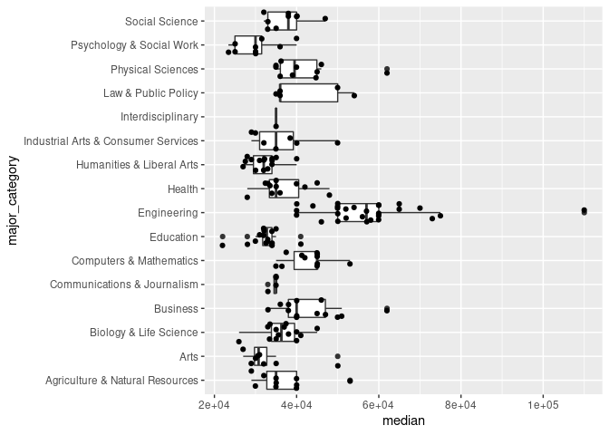

Activity 5
================
Moreen19

## Data and packages

Again, we will load all of the `{tidyverse}` for this Activity.

``` r
library(tidyverse)
```

We continue our exploration of college majors and earnings from the data
behind the FiveThirtyEight story [The Economic Guide To Picking A
College
Major](https://fivethirtyeight.com/features/the-economic-guide-to-picking-a-college-major/).
Remember that there are many considerations that go into picking a
major. Earning potential and employment prospects are two (important) of
these considerations, but they do not tell the entire story.

We read in the same data from Activity 4 below, but notice that this
code is now surrounded in parentheses.

``` r
(college_recent_grads <- read_csv("data/recent-grads.csv"))
```

    ## # A tibble: 173 x 21
    ##     rank major_code major           major_category total sample_size   men women
    ##    <dbl>      <dbl> <chr>           <chr>          <dbl>       <dbl> <dbl> <dbl>
    ##  1     1       2419 Petroleum Engi… Engineering     2339          36  2057   282
    ##  2     2       2416 Mining And Min… Engineering      756           7   679    77
    ##  3     3       2415 Metallurgical … Engineering      856           3   725   131
    ##  4     4       2417 Naval Architec… Engineering     1258          16  1123   135
    ##  5     5       2405 Chemical Engin… Engineering    32260         289 21239 11021
    ##  6     6       2418 Nuclear Engine… Engineering     2573          17  2200   373
    ##  7     7       6202 Actuarial Scie… Business        3777          51  2110  1667
    ##  8     8       5001 Astronomy And … Physical Scie…  1792          10   832   960
    ##  9     9       2414 Mechanical Eng… Engineering    91227        1029 80320 10907
    ## 10    10       2408 Electrical Eng… Engineering    81527         631 65511 16016
    ## # … with 163 more rows, and 13 more variables: sharewomen <dbl>,
    ## #   employed <dbl>, employed_fulltime <dbl>, employed_parttime <dbl>,
    ## #   employed_fulltime_yearround <dbl>, unemployed <dbl>,
    ## #   unemployment_rate <dbl>, p25th <dbl>, median <dbl>, p75th <dbl>,
    ## #   college_jobs <dbl>, non_college_jobs <dbl>, low_wage_jobs <dbl>

Compare this code output to the `load_data` chunk in your knitted
Activity 4 `.md` report. What does enclosing an assignment code (i.e.,
`object_name <- r_code`) in parentheses do?

**Response**:

It gives details of the rows and columns and produces a tibble.

### Data Codebook

Descriptions of the variables are again provided below. Again note that
the ACS only asks [one
question](https://www.census.gov/acs/www/about/why-we-ask-each-question/sex/)
about a person’s sexual identity.

| Header                         | Description                                                                 |
|:-------------------------------|:----------------------------------------------------------------------------|
| `rank`                         | Rank by median earnings                                                     |
| `major_code`                   | Major code, FO1DP in ACS PUMS                                               |
| `major`                        | Major description                                                           |
| `major_category`               | Category of major from Carnevale et al                                      |
| `total`                        | Total number of people with major                                           |
| `sample_size`                  | Sample size (unweighted) of full-time, year-round ONLY (used for earnings)  |
| `men`                          | Male graduates                                                              |
| `women`                        | Female graduates                                                            |
| `sharewomen`                   | Women as share of total                                                     |
| `employed`                     | Number employed (ESR == 1 or 2)                                             |
| `employed_full_time`           | Employed 35 hours or more                                                   |
| `employed_part_time`           | Employed less than 35 hours                                                 |
| `employed_full_time_yearround` | Employed at least 50 weeks (WKW == 1) and at least 35 hours (WKHP &gt;= 35) |
| `unemployed`                   | Number unemployed (ESR == 3)                                                |
| `unemployment_rate`            | Unemployed / (Unemployed + Employed)                                        |
| `median`                       | Median earnings of full-time, year-round workers                            |
| `p25th`                        | 25th percentile of earnings                                                 |
| `p75th`                        | 75th percentile of earnings                                                 |
| `college_jobs`                 | Number with job requiring a college degree                                  |
| `non_college_jobs`             | Number with job not requiring a college degree                              |
| `low_wage_jobs`                | Number in low-wage service jobs                                             |

The questions we will answer in this activity are:

-   How do the distributions of median income compare across major
    categories?
-   Do women tend to choose majors with lower or higher earnings?

## Analysis

### Median Earnings Description

### Median … Median Earnings

For the rest of this semester, I will no longer provide you with R code
chunks. Have no fear! There are a number of ways to create a code chunk:

-   Tired: Copy-and-paste a previous code chunk, delete the code, then
    add your new code
-   Wired: Click on the 
    and select  (notice all
    the different types of code chunks that you can use within an
    RMarkdown file!)
-   Inspired: Ctrl/Command + Alt/Option + I

Below, create a code chunk and name it `median_earnings`. Make sure
there is an empty line above and below the code chunk.

In your newly created R code chunk, verify that the median income for
all majors was $36,000. Using the `college_recent_grads` dataset and
functions from `{dplyr}`, verify the *median* summary statistic for the
variable median earnings of full-time, year-round workers (`median`).
Name this numerical summary `median_all_majors`.

``` r
college_recent_grads %>%
summarise(median_all_majors = median(median))
```

    ## # A tibble: 1 x 1
    ##   median_all_majors
    ##               <dbl>
    ## 1             36000

 **Planned Pause Point**: If you have any
questions, contact your instructor. Otherwise feel free to continue on.

### Additional Summaries of Median Earnings

Often we would like more information than the median to help us to
better understand the distribution of a variable. Using the
`college_recent_grads` dataset and functions from `{dplyr}`, obtain the
sample size (i.e., *n*umber of observations), *mean*, *s*tandard
*d*eviation, *min*imum, *median*, and *max*imum summaries for the
variable `median` earnings of full-time, year-round workers. Be careful
when you name your output summaries as we are dealing with things that
could use the same name (i.e., “median”). When I and obtaining numerical
summaries for variables, I like to include the variable name in my
summary name (e.g., `mean_med_earnings = mean(median)`). Create a code
chunk and name it `summary_earnings`.

``` r
college_recent_grads %>%
summarise(mean_median = mean(median),
          standard_dev_mean = sd(median),
          min_median = min(median),
          med_median = median(median),
          max_median = max(median))
```

    ## # A tibble: 1 x 5
    ##   mean_median standard_dev_mean min_median med_median max_median
    ##         <dbl>             <dbl>      <dbl>      <dbl>      <dbl>
    ## 1      40151.            11470.      22000      36000     110000

Provide a discussion on what you believe the distribution of median
earnings will look like. You should discuss the center, spread, and
potential shape only using these values - I do NOT want to see any data
visualizations here.

**Response**: Because the mean is more than the median the distribution
will be skewed to the right.The spread is more to the right of the mean.

### Median Earnings by Major Category

Now we will see how the different major categories compare to the
overall distribution of median earnings. Using the
`college_recent_grads` dataset and functions from `{dplyr}`, obtain
similar summaries of the variable `median` earnings of full-time,
year-round workers as your `summary_earnings` code chunk, *by* for each
`major_category`. *Arrange* this summary table by the median earning.
Create a code chunk and name it `major_earnings`.

``` r
college_recent_grads %>%
group_by(major_category) %>%
summarise(mean_median = mean(median),
          standard_dev_mean = sd(median),
          min_median = min(median),
          med_median = median(median),
          max_median = max(median)) %>%
arrange(med_median) %>%
knitr::kable()
```

| major\_category                     | mean\_median | standard\_dev\_mean | min\_median | med\_median | max\_median |
|:------------------------------------|-------------:|--------------------:|------------:|------------:|------------:|
| Psychology & Social Work            |     30100.00 |            5381.914 |       23400 |       30000 |       40000 |
| Arts                                |     33062.50 |            7223.165 |       27000 |       30750 |       50000 |
| Humanities & Liberal Arts           |     31913.33 |            3393.032 |       27000 |       32000 |       40000 |
| Education                           |     32350.00 |            3892.728 |       22000 |       32750 |       41000 |
| Agriculture & Natural Resources     |     36900.00 |            6935.416 |       29000 |       35000 |       53000 |
| Communications & Journalism         |     34500.00 |            1000.000 |       33000 |       35000 |       35000 |
| Health                              |     36825.00 |            5776.461 |       28000 |       35000 |       48000 |
| Industrial Arts & Consumer Services |     36342.86 |            7290.829 |       29000 |       35000 |       50000 |
| Interdisciplinary                   |     35000.00 |                  NA |       35000 |       35000 |       35000 |
| Law & Public Policy                 |     42200.00 |            9066.422 |       35000 |       36000 |       54000 |
| Biology & Life Science              |     36421.43 |            4528.912 |       26000 |       36300 |       45000 |
| Social Science                      |     37344.44 |            4750.556 |       32000 |       38000 |       47000 |
| Physical Sciences                   |     41890.00 |            8251.660 |       35000 |       39500 |       62000 |
| Business                            |     43538.46 |            7774.053 |       33000 |       40000 |       62000 |
| Computers & Mathematics             |     42745.45 |            5108.691 |       35000 |       45000 |       53000 |
| Engineering                         |     57382.76 |           13626.080 |       40000 |       57000 |      110000 |

Provide a discussion on how each major compares to the overall
distribution. You should discuss the center, spread, and potential shape
only using these summary values - I do NOT want to see any data
visualizations here.

**Response**:the lowest earners are psychology and social science ,the
earning within the median range are industrial arts & consumer services
and interdisciplinary courses.The highest earners are computer and
mathematics and Engineering.

Before we continue, add the following to the end of your pipeline (you
will need to pipe first) in your `major_earnings` code chunk:

    knitr::kable()

Knit your document with and without this last piped code. What changes
about the output? When would this `knitr::kable` code be useful?

**Response**:

The output has details of all the various variables fitting on one
screen and i am able to scroll up and down the table. it can be useful
in displaying summary data .

 **Planned Pause Point**: If you have any
questions, contact your instructor. Otherwise feel free to continue on.

### Visualize Median Earnings by Major Category

Let us see how well your descriptions in the [Median Earnings by Major
Category](#median-earnings-by-major-category) section compare to the
actual distributions. Plot the distribution of the variable `median`
earnings of full-time, year-round workers for each `major_category`
using the *boxplot* and *jitter* geometries. Create a code chunk and
name it `major_boxplot`.

``` r
ggplot(data = college_recent_grads, mapping = aes(x = median, y = major_category )) +
geom_boxplot() +
geom_jitter()
```

<!-- -->

Provide a discussion on how your descriptions in the Median Earnings by
Major Category section compares.

**Response**: My descriptions are similar to what the box and jitter
plots convey.


<b>Planned Pause Point</b>: If you feel that you have a good
understanding of these commands, feel free to start working on your
project. The remainder of this activity will help to expand these
commands.

### Multiple Rankings

#### Ranking by `major_category`

The current rankings provided in the data are by `major`. Here we will
develop a series of rankings to see how the `major_category` levels
perform. Create a code chunk and name it `category_rankings`. In this
code chunk,

1.  Group `college_recent_grads` by `major_category`
2.  Summarize the variable `total` as the *sum* across all majors (to
    get the total number of majors within a `major_category`) and the
    following variables by their *median* value: `sharewomen`,
    `unemployment_rate`, and `median` earnings. Provide a meaningful
    name to each summarized value.
3.  Assign/create a *rank* for each summarized value (rank for `total`,
    rank for `sharewomen`, etc.) and provide a meaningful name to each
    ranked column value.
4.  Arrange the results so that `major_category` appear in alphabetical
    order (“A” at the top).

``` r
college_recent_grads %>%
group_by(major_category) %>%
summarise(            
                      median_sharewomen = median(sharewomen),
                      median_unemployment = median(unemployment_rate),
                      median_median_earn = median(median)
                      ) %>%
mutate(
        rank(median_sharewomen),
        rank(median_unemployment),
        rank(median_median_earn)
) %>%
  
arrange(major_category) %>%
knitr::kable()
```

| major\_category                     | median\_sharewomen | median\_unemployment | median\_median\_earn | rank(median\_sharewomen) | rank(median\_unemployment) | rank(median\_median\_earn) |
|:------------------------------------|-------------------:|---------------------:|---------------------:|-------------------------:|---------------------------:|---------------------------:|
| Agriculture & Natural Resources     |                 NA |            0.0553146 |                35000 |                       16 |                          3 |                          7 |
| Arts                                |          0.6665767 |            0.0894636 |                30750 |                        9 |                         14 |                          2 |
| Biology & Life Science              |          0.5827521 |            0.0679693 |                36300 |                        8 |                          8 |                         11 |
| Business                            |          0.4413556 |            0.0697490 |                40000 |                        4 |                          9 |                         14 |
| Communications & Journalism         |          0.6715709 |            0.0721767 |                35000 |                       10 |                         11 |                          7 |
| Computers & Mathematics             |          0.2691939 |            0.0908233 |                45000 |                        3 |                         15 |                         15 |
| Education                           |          0.7693684 |            0.0487851 |                32750 |                       12 |                          1 |                          4 |
| Engineering                         |          0.2271179 |            0.0598242 |                57000 |                        1 |                          5 |                         16 |
| Health                              |          0.7833359 |            0.0642609 |                35000 |                       14 |                          6 |                          7 |
| Humanities & Liberal Arts           |          0.6901107 |            0.0817422 |                32000 |                       11 |                         12 |                          3 |
| Industrial Arts & Consumer Services |          0.2324435 |            0.0556769 |                35000 |                        2 |                          4 |                          7 |
| Interdisciplinary                   |          0.7709011 |            0.0708609 |                35000 |                       13 |                         10 |                          7 |
| Law & Public Policy                 |          0.4764612 |            0.0824522 |                36000 |                        5 |                         13 |                         10 |
| Physical Sciences                   |          0.5204274 |            0.0510984 |                39500 |                        6 |                          2 |                         13 |
| Psychology & Social Work            |          0.7989198 |            0.0651122 |                30000 |                       15 |                          7 |                          1 |
| Social Science                      |          0.5434054 |            0.0972439 |                38000 |                        7 |                         16 |                         12 |

Provide a discussion on how the `major_category` rankings compare.

**Response**:

 **(Final) Planned Pause Point**: If you
have any questions, contact your instructor. Otherwise feel free to
continue on.

Knit, then stage everything listed in your **Git** pane, commit (with a
meaningful commit message), and push to your GitHub repo. Go to GitHub
and verify that your `activity04-data-pieplines.Rmd` file appears as you
intended it to.

You can now go back to the `README` file.

## Attribution

This activity is inspired by a lab from [Dr. Mine
Çetinkaya-Rundel](http://www2.stat.duke.edu/~mc301/)’s STA 199 course.
